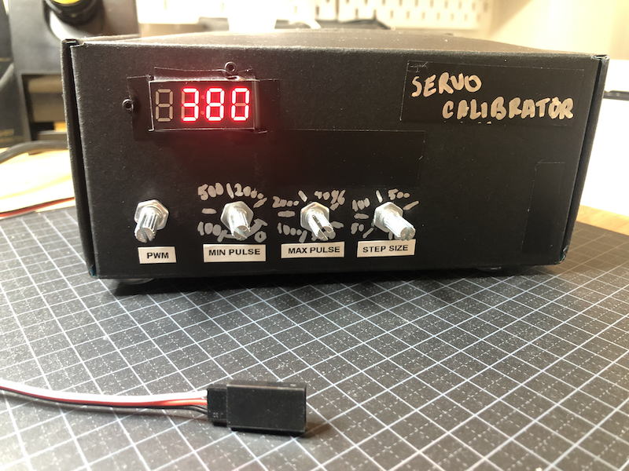
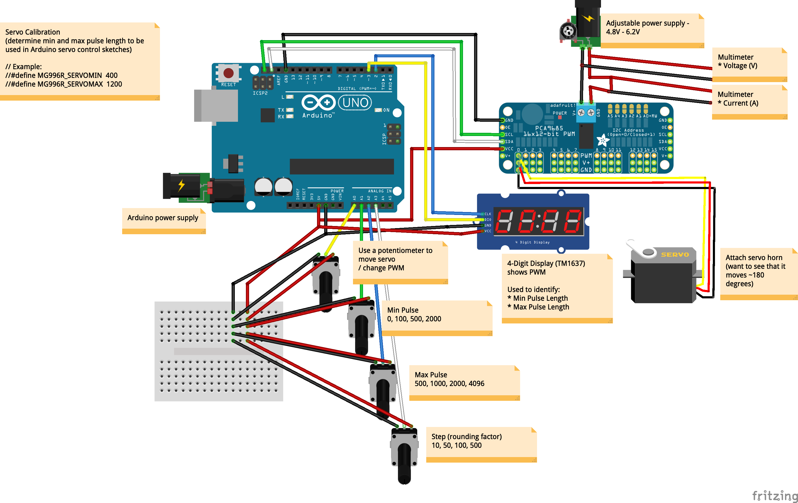

# Servo calibration using Arduino

Tool to determine min and max pulse widths to use for a servo

Video: https://www.youtube.com/watch?v=QkUJ3FRBVaw

Wiring diagram:

Other tutorials:
* Servos might be different from each other, even if it is the same model (see tests here: https://www.hackster.io/jeremy-lindsay/how-accurate-are-my-servos-21f703 and https://www.hackster.io/jeremy-lindsay/calibrating-my-servos-fa27ce)
* If it exceedes a range it drains a lot of power and then gets stuck (like here: https://www.instructables.com/id/Calibrating-Servos-for-Bracketrobot-Arm/)
* Calibration videos: https://www.youtube.com/watch?v=cvqAoBrLs7M and https://www.youtube.com/watch?v=C4amAdbH60w

